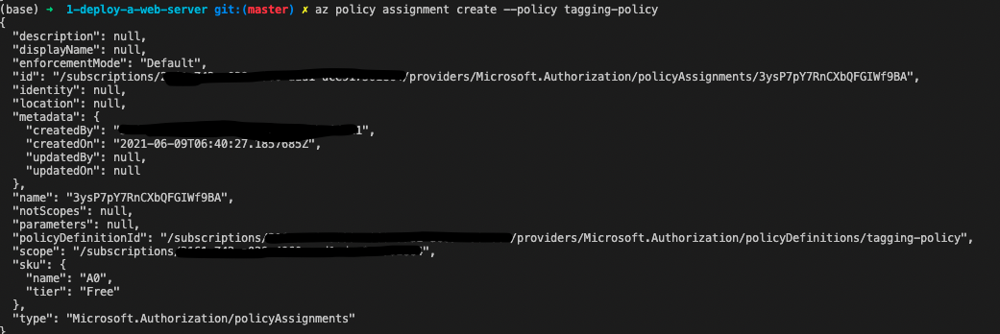

# Udacity Azure DevOps Nanodegree - Project 1: Deploy a Web Server in Azure


# To-Do List:

- NSGs in loop/list
- Set max count to 5
-


## Introduction
_Keep it short - one or two liners at most_.

In this project, the aim is to deploy a web server on Azure through _Infrastructure as Code_ by using Terraform and Packer. 

## Getting Started
_What you need to do before you even get ready to build the code."_

For this project to run, you will need an Azure account with a valid subscription. 

Once you have signed up for Azure, you can go ahead and clone this repo and continue with this setup guid. 

## Dependencies
_List the things that the building of the actual software is dependent on_. These are your required libraries or software._

Before going through the instructions, make sure you have the completed the following:
1. Installed the Azure CLI on your machine
2. Logged in to Azure CLI by running `az login`
3. Installed [Terraform](https://www.terraform.io/downloads.html)
4. Installed [Packer](https://www.packer.io/docs/install)
5. Create an Azure Resource Group for this project by running `az group create --location uksouth --resource-group udacity-project-1`

## Instructions
_Once all the dependencies are satisfied, follow these instructions to replicate the solution._


### Create the Policy Definition

Create policy definition using azure cli
```
az policy definition create --name tagging-policy --rules policy.rules.json --mode indexed --display-name "Deny the creation of a resource that does not have tags"
```

Assign the tagging policy
```
az policy assignment create --policy tagging-policy
```

Notes:
* Using mode `indexed` because only resources with tags available should be evaluated
* This policy will detect if any resource has less than 1 tag assigned. 


### Deploy an Image Definition with Packer

Before running these steps, create the following .env file or set those env variables in your shell. 

_.env_
```
export ARM_CLIENT_SECRET=<SERVICE PRINCIPAL CLIENT SECRET HERE>
export ARM_CLIENT_ID=<SERVICE PRINCIPAL CLIENT ID HERE>
export TF_VAR_subcription_id=<SERVICE PRINCIPAL SUBSCRIPTION HERE>
```

To populate the .env file with those values, create a service principal by running:

```
TODO: RBAC service principla command
```


Once you have the .env created, source the environment variables by running `source .env`

```
packer build server.json
```

This should create an image on Azure called `myPackerImage`. Validate that this was successful by running:

```
az image list
```

### Deploy Infrastructure using Terraform

#### Initialise the terraform module
```
terraform init
```


#### Import existing resource group

Because we are using packer for the VM image, we needed to create the resource group first and deploy the image to that resource group. Terraform needs to know about existing resources in order to determine which resources to create/alter/destroy. So, we need to import the existing resource group into the Terraform state by running:
```
terraform import azurerm_resource_group.main /subscriptions/$TF_VAR_subcription_id/resourceGroups/udacity-project-1
```

Where `$TF_VAR_subcription_id` is the subscription ID of your active Azure account set in the `.env` file.


### Plan the changes
```
terraform plan -var subscription_id=$TF_VAR_subscription_id -out solution.plan
```


### Apply the changes
```
terraform apply "solution.plan"
```

Notes
* Using the `TF_VAR_name` environment variable syntax did not work as expected. Instead, I had to fall back on passing the subscription_id variable as a command line argument.


### Wrap Up

If you've ran all the instructions above, be sure to clean up the resources when you're done by running:

```
terraform destroy
```


## Output
_Show the reader what the expected result will look like when they've successfully followed the instructions._


### Policy

After completing the policy assign you should see the following output:



### Packer Image


### Terraform


## Notes

_Is packer really necessary?_

If you really think about it, Packer is not strictly necessary in this project context. The requirement is that the VMs being created are identical, which is more than achievable by simply using the `azurerm_linux_virtual_machine` configuration in Terraform.

However, in a production context it would be helpful to use Packer as this provides us with more flexibility to configure the VM image during deployment. 

